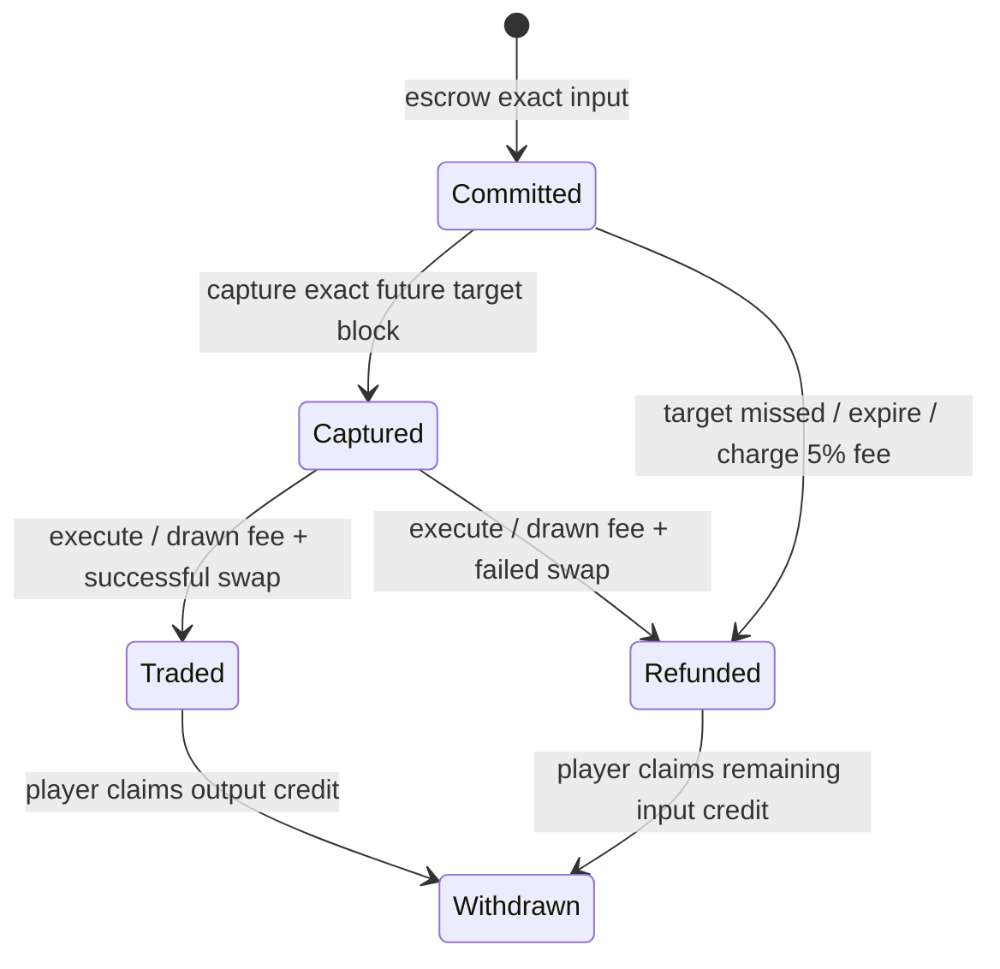

# Haunted game protocol — experimental Sepolia only

This revision separates ordinary swaps from randomized game trades. Ordinary swaps through existing
v4 routers pay a 0.30% LP fee, emit NormalTrade/SwapResolved and do not change game corruption.
An owner-forced demonstration still applies immediately to ordinary swaps. Only funded commitments
through `HauntedHook.game()` receive unforced random outcomes. No VRF or external oracle is configured.

## Commitment and resolution

1. The player calls `HauntedGame.commit(zeroForOne, amountIn, minOut)`. The canonical haunted pool
   must have active liquidity. Inputs are exact-input amounts in minor units, from 1 to `int128.max`;
   `minOut` must be nonzero. For ETH input send exactly `amountIn` as value. For VOID input approve
   the game for that amount and send no ETH. The direct caller becomes the beneficiary.
2. The contract escrows the full input and stores the player, direction, minimum output, corruption
   level and `targetBlock = block.number + 128`. They cannot be edited or cancelled. A caller cannot
   change a commitment's beneficiary, including through hookData. `Committed` identifies the ticket.
3. A keeper or any participant calls `captureEntropy()` **in that exact target block**. It stores
   `block.prevrandao` once for all tickets with that target. No caller supplies the entropy, and
   re-capture is refused. Zero is a valid captured value, distinguished by `captured(target)`.
4. After the target block, anyone calls `execute(ticketId)`. The roll is
   `keccak256(abi.encode(entropy[target], chainId, gameAddress, ticketId)) % 1000`.
   The eight bands and fee formula use the corruption level stored at commitment. Neither later
   blocks, execution order, a new amount nor the owner's current forced outcome changes that draw.
5. The game deducts `ceil(amountIn * feePips / 1_000_000)` from escrow, reserves it for LPs and
   attempts to donate reserved fees to the canonical pool. It then executes the remaining input
   in an isolated PoolManager unlock. The hook charges no additional LP fee on this route.
   A free draw deducts zero. Rounding can dominate tiny input amounts; the fee formula, including
   upward rounding to a minor unit, must be displayed by the frontend.
6. A successful trade must consume all of the remaining input and produce at least `minOut`.
   Its output becomes `credit(player, outputCurrency)`. The hook applies the selected game effect
   and emits its outcome and SwapResolved. A jackpot pays the fixed player from the JackpotVault;
   a recipient/vault rejection records JackpotSkipped and does not block the trade.
7. The player calls `withdraw(currency, recipient)` for outputs or refunds. ETH uses currency
   address zero. An executor has no claim to another player's credit. Failed withdrawals preserve
   credit; the player can retry to another recipient. Zero/self recipients and zero credits revert.

## Failure and accounting rules

* Before or during the target block, execution reverts. Tickets settle once. A captured ticket
  cannot expire or reroll; execution can happen at any later block using the stored entropy.
* If the target block passed without capture, `execute` reverts `EntropyUnavailable`; anyone may
  call `expire`. This deducts the maximum 50,000-pip (5%) fee and credits the remaining input to the
  player. Late capture is impossible. There is no full-refund path that can select losing draws.
* Execution forwards a fixed 2,000,000 gas to the swap. A caller supplying too little to forward
  that budget and finish accounting reverts the entire transaction, including the fee charge. A
  swap exceeding this fixed budget fails like a slippage failure. Operators must estimate gas for
  the full execution, not just the swap.
* Slippage failure, partial fill, missing liquidity or another swap revert records `TradeFailed`
  and credits the input **after** the drawn fee. The isolated swap and its game effects roll back;
  the previously charged fee does not. A tight minimum output cannot make all paying outcomes free
  to abandon. Keepers may execute tickets even when the player would prefer to abandon them.
* `execute`, `expire` and `flushFees` revert `ManagerUnlocked` when called while the PoolManager is
  already unlocked, that is from inside another contract's `unlockCallback`, a hook callback or a
  router. The manager would reject the game's own unlock as `AlreadyUnlocked`, which must not count
  as a failed trade: the ticket stays open, no fee is charged and a later top-level call settles
  it with the same stored draw. Keepers must call these functions from a top-level transaction or
  from a contract that is not itself inside a PoolManager unlock.
* When the pool has no active liquidity, fee donation can fail. `lpFees0/1` remain reserved in the
  game and cannot be withdrawn by a player or administrator. Anyone can call `flushFees()` when
  liquidity returns. Fees go to the LPs active at donation time, including liquidity added later;
  there is no historical LP snapshot. Player refunds remain withdrawable while donation is deferred.
* Native/token balances cover unresolved inputs, player credits and undelivered LP fees. Invariant
  tests assert this equality across mixed commitments, outcomes, failures, expiry and withdrawals.
* Game swaps use the usual extreme v4 price limits and enforce the committed minimum output and
  full fill. Ordinary swaps remain responsible for their own router slippage/deadline protections.
  PoolManager protocol fees, if configured by its administrator, are separate from these LP fees.

## Keeper and frontend responsibilities

Monitor `Committed` events and maintain a schedule of target blocks. Include capture in every
requested target block, execute captured tickets afterwards and expire missed tickets. There is no
keeper payment or exclusive keeper role. The frontend should show the target block, capture status,
fixed minimum output, pending/resolved state, charged fee, any failure reason and claimable credit.
Warn players before commitment that execution is delayed, prices can move, failed trades retain
fees and a missed beacon capture costs the maximum fee. Do not route a game's input through an
unrelated router: that contract, not its end user, would become the committed player.

Monitor `SwapResolved` for game effects and `Settled` for the ticket/fee/output result. `CorruptedFee`
emits the level used to price its fee. `SwapResolved.corruption` is the post-effect level. An ordinary
trade's zero roll is a placeholder. Zero output in `Settled` plus `TradeFailed` means there was no
successful game swap. Jackpot/charity skips are separate from a failed trade.

## Trust and economic limits

The entropy is a fixed future beacon value, not the execution block's value or an operator-selected
seed. This prevents the reported same-transaction amount search and selective transaction rollback
from undoing the earlier funded commitment. Capturing beacon entropy is verifiable on-chain, but it
is **not a VRF**: proposers can bias beacon values or censor capture, and keepers can fail. See
[EIP-4399](https://eips.ethereum.org/EIPS/eip-4399#security-considerations) for beacon assumptions.
Use only expendable Sepolia funds; valuable randomness requires a separately reviewed VRF design.

Many dust commitments can still farm future winning tickets. Cooldowns are shared by all players,
so executors can prioritize a winning ticket and other jackpots may be skipped. Neither economic
fairness nor an equal chance of receiving a payout is promised. The owner retains requested demo
controls and vault administration: it can force direct jackpots, grant itself trigger roles, change
the charity to itself and receive capped releases repeatedly. Donors must trust that authority.
